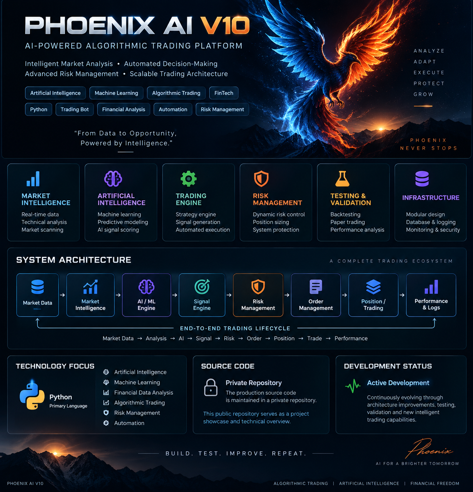

<p align="center">
  
</p>

<h1 align="center">🚀 Phoenix AI V10</h1>

<h3 align="center">AI-Powered Algorithmic Trading Platform</h3>

<p align="center">
  <strong>Artificial Intelligence • Machine Learning • Market Intelligence • Risk Engineering • Automated Trading</strong>
</p>

<p align="center">
  
  
  
  
  
</p>

---

## 🧠 Executive Overview

**Phoenix AI V10** is an actively developed algorithmic trading platform designed to combine artificial intelligence, machine learning, market intelligence, risk management, execution infrastructure and operational monitoring within a unified architecture.

The project is intentionally designed as **trading infrastructure**, not as a single strategy or a simple trading script.

Its core lifecycle is:

**Market Data → Intelligence → AI/ML → Signal → Risk → Execution → Position → Trade → Analytics**

The architecture is designed to evolve as new models, strategies, risk controls and execution capabilities are introduced.

---

## 🎯 Vision

> **Build intelligent trading infrastructure, not just trading signals.**

Phoenix AI V10 focuses on five engineering goals:

- **Intelligence** — combine market information with AI/ML-based evaluation.
- **Risk** — treat capital and exposure protection as first-class system concerns.
- **Execution** — separate decisions from order and position lifecycle management.
- **Reliability** — make system behavior observable, testable and diagnosable.
- **Scalability** — keep the architecture modular so new capabilities can be added without redesigning the entire platform.

---

## 📌 Project Status

| Area | Direction |
|---|---|
| Core Architecture | 🟢 Active Development |
| Market Data & Intelligence | 🟢 Active Development |
| AI / ML Engine | 🟢 Active Development |
| Signal & Strategy Layer | 🟢 Active Development |
| Risk Management | 🟢 Active Development |
| Order / Position / Trade Systems | 🟢 Active Development |
| Backtesting & Validation | 🟢 Active Development |
| Monitoring & Reliability | 🟢 Active Development |
| Adaptive Market Intelligence | 🟡 Planned / Expanding |
| Advanced Protection Systems | 🟡 Planned / Expanding |
| Execution Quality Telemetry | 🟡 Planned / Expanding |
| Multi-Account / Multi-Broker Architecture | 🟡 Planned / Expanding |
| Production Hardening | 🟡 Planned / Expanding |

> Status labels describe the current development direction of the public architecture showcase. They do not represent a claim of production readiness or trading performance.

---

## 🏗️ High-Level Architecture

Phoenix AI V10 follows a layered, modular architecture.

```text
Market Data
     ↓
Data Management
     ↓
Market Intelligence
     ↓
Feature Engineering
     ↓
AI / ML Engine
     ↓
Signal Engine
     ↓
Risk Management
     ↓
Order Management
     ↓
Position Management
     ↓
Trade Management
     ↓
Analytics & Observability
